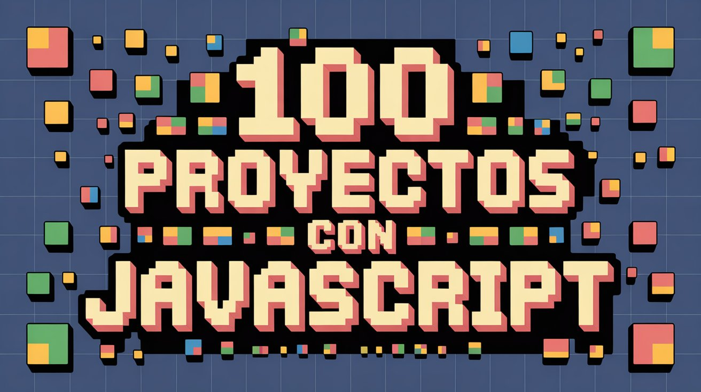

# ⚡🖥️ **JAVASCRIPT100 – Colección de Proyectos y Scripts** 🎯✨

🌟 **Bienvenido a mi espacio de desarrollo en JavaScript** 🌟  
Aquí encontrarás **100 proyectos, miniapps y scripts** que exploran la versatilidad del lenguaje en **frontend y backend**, aplicando buenas prácticas y técnicas modernas.

> 💡 **Objetivo:** Fortalecer habilidades en **JavaScript** mediante retos prácticos, proyectos creativos y utilidades funcionales que cubran desde la manipulación del DOM hasta el trabajo con APIs y Node.js.

---

## 🔥 **¿QUÉ ENCONTRARÁS EN ESTE REPOSITORIO?**  

✅ **Proyectos web interactivos** 🌐 – Interfaces dinámicas y responsivas.  
✅ **Scripts prácticos** 🛠️ – Herramientas útiles para tareas comunes.  
✅ **Integración con APIs** 🌍 – Consumo y manejo de datos externos.  
✅ **Ejercicios de lógica y algoritmos** 🧠 – Retos para mejorar la resolución de problemas.  
✅ **Aplicaciones con Node.js** ⚙️ – Backend ligero y scripts de servidor.  

🎯 **Este repositorio está en constante crecimiento**, incorporando nuevas ideas y optimizaciones.

---

## 🛠️ **TECNOLOGÍAS Y CONCEPTOS UTILIZADOS**  

💻 **JavaScript (ES6+)** – Sintaxis moderna y eficiente.  
🎨 **Manipulación del DOM** – Creación y control de elementos dinámicos.  
📦 **Node.js** – Ejecución de JS en servidor y automatización.  
📡 **Fetch API / AJAX** – Comunicación con APIs y carga de datos.  
🎭 **Eventos y animaciones** – Interactividad fluida en el navegador.  
⚡ **Optimización de rendimiento** – Mejores prácticas para apps rápidas.  

> 🏆 **Enfoque en código claro, escalable y adaptable a distintos entornos.**

---

## 🚀 **OBJETIVO DE ESTE REPOSITORIO**  

> 💡 **JAVASCRIPT100 es un laboratorio de creatividad y aprendizaje**, diseñado para explorar al máximo las posibilidades del lenguaje.  
Cada proyecto es un paso para **dominar JavaScript** tanto en el navegador como en el servidor.

---
